# Doggos application

The application purpose is to count the number of adopted dogs in the particular dog shelter within a working day.

## Description

The application takes the number of the dog adoptions provided to it and generate the report, which can be used later to review the dog shelter activities within the last 24 hours. The report says how many dogs were adopted in the dog shelter per the dog breed.

The application is a simple batch program. It reads the sequential dataset (input) and produces the output sequential dataset (report) as a result. The application written in the plain COBOL language.

### How to work with the ISPF menus

Usually, the ISPF menus are hard to understand to the beginners. But, actually, for this particular project, you have to understand two things:

- Use 'Command' or 'Option' input line to execute the command or go into the particular ISPF panel.

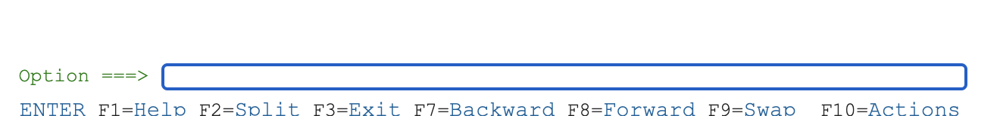

- All the ISPF options usually starts with the number or a letter, so you can use this symbol to go into the specific panel.

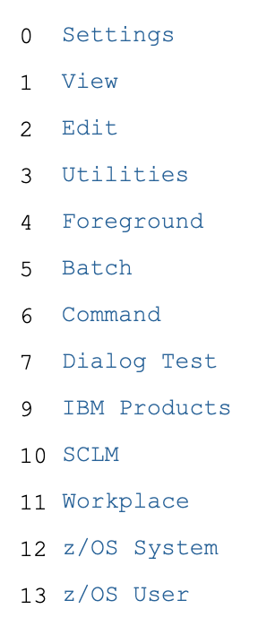

### Getting started

**Any modern browser installed on the client machine - is the only dependency. But the tips and screenshots will be given for the Google Chrome v101 Browser.**

- [Connection link](https://35.245.180.49:1443/zosmf/LogOnPanel.jsp)

**Note: in case of the certificate error, please, proceed with the advanced option and establish the temporarily connection**

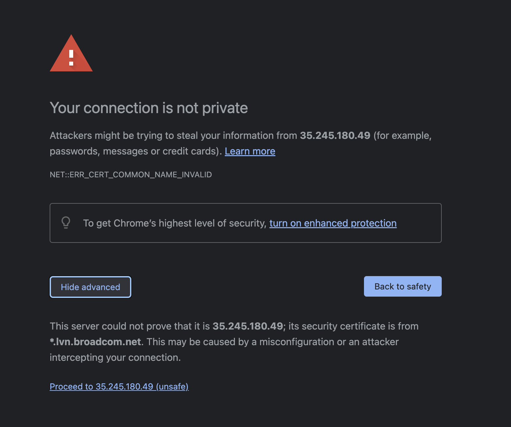

- Double click on the ISPF application to start the ISPF session.

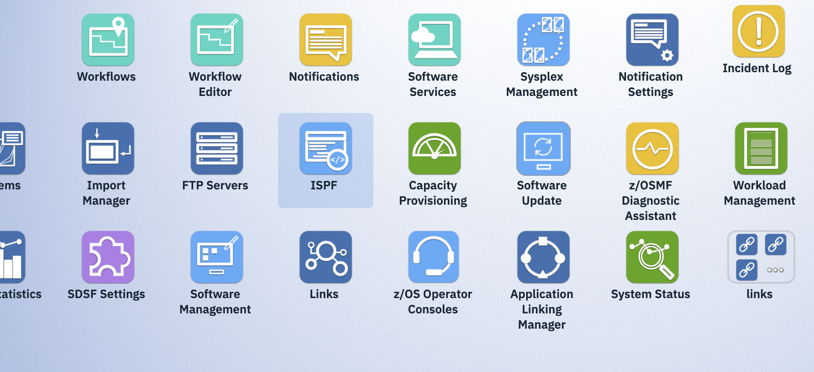

- Adjust the ISPF session settings, if needed and press 'OK', then press 'OK' again to skip the informational messages.

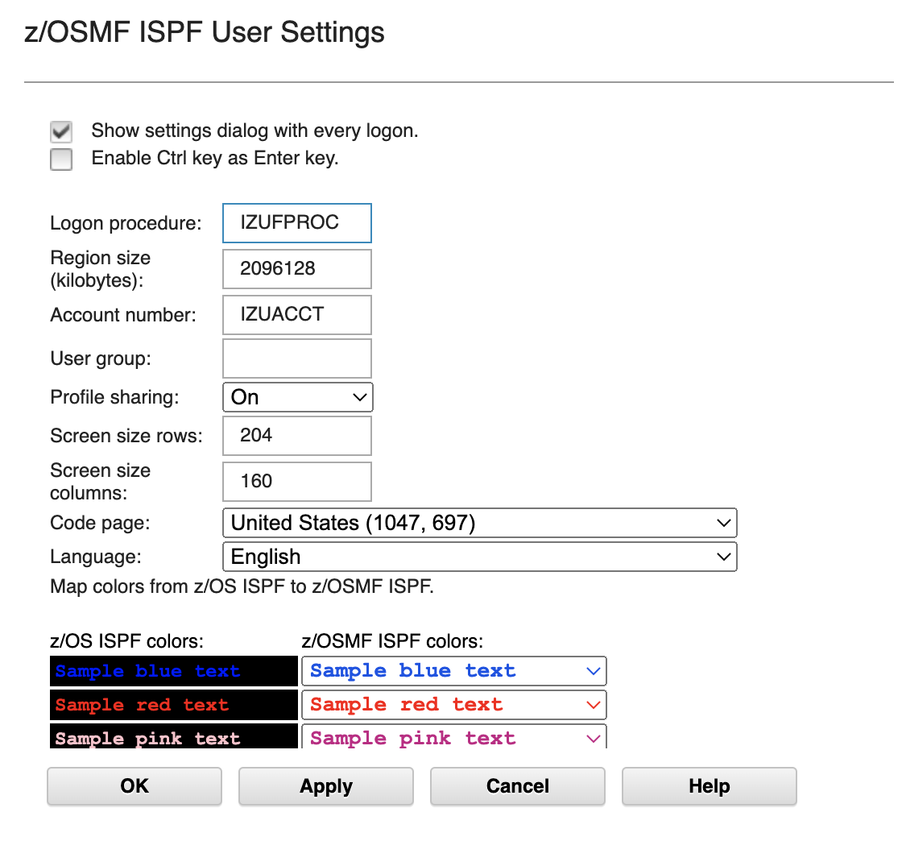

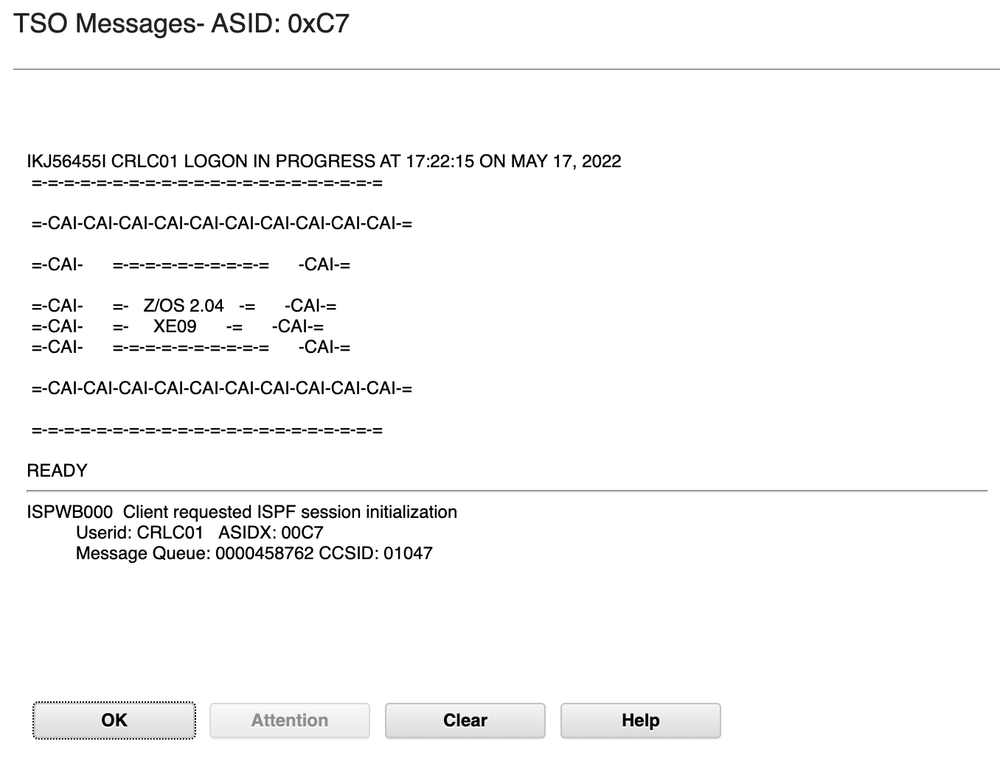

- Open the 'Command' (6) ISPF screen.

  - You can always return to this particular menu using `=6` option.

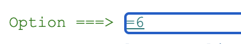

- Copy the command: `EX 'SYSEDUC.CLIST(EDUSCMI1)' 'ENDIE000'` and paste it into the textarea, press Enter. This command will lead you directly into the Endevor ISPF development mode.

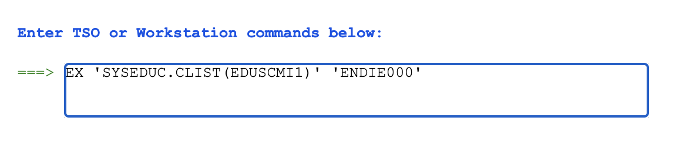

### Endevor inventory details

- You should use the `SMPLTEST` development **environment** and the `GSECONF` **system** to work with the program.

- You should use your **USERID** development **subsystem** and your **USERID** development **CCID&Comment** to group the changes together.

- You should use the `List Using Map: Y` and `Return First Found: Y` **List options**.

- You should use the `Override Signout: Y` **action option**.

### How to edit the source code

1. Search for the elements using the [inventory details](#endevor-inventory-details) above.

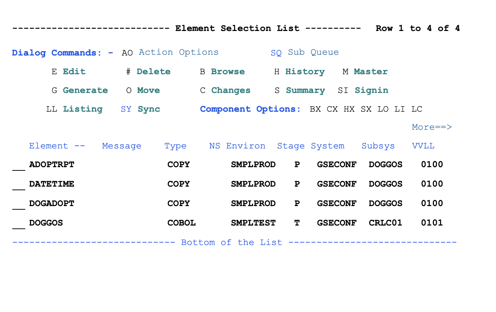

**Note: if there will be an information or a warning message during the search, just press the `Enter` to continue.**

2. Use the `Edit` command to start editing the element `DOGGOS`.

3. Use the `save` command to save your changes.

   - You can always use F3 (exit), F12 (cancel), F8 (down), F7 (up) keyboard buttons to scroll the panel and go back and forth.

**Note: after the edit session will be over (after the F3 pressed), the generation of the element will be triggered automatically.**

### Run the program manually

1. Edit the program using the [guide](#how-to-edit-the-source-code) above.

   - You can also use `g` command to trigger the generation for the element in the search.

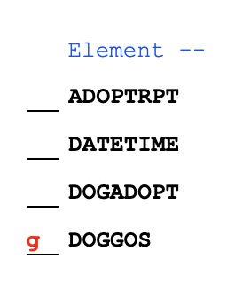

2. Enter the `=3.4` ISPF command to search for the test datasets.

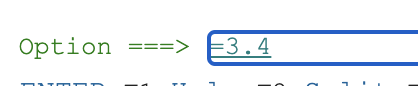

3. Enter a search pattern to get the list of specific datasets for this particular project and this particular user.

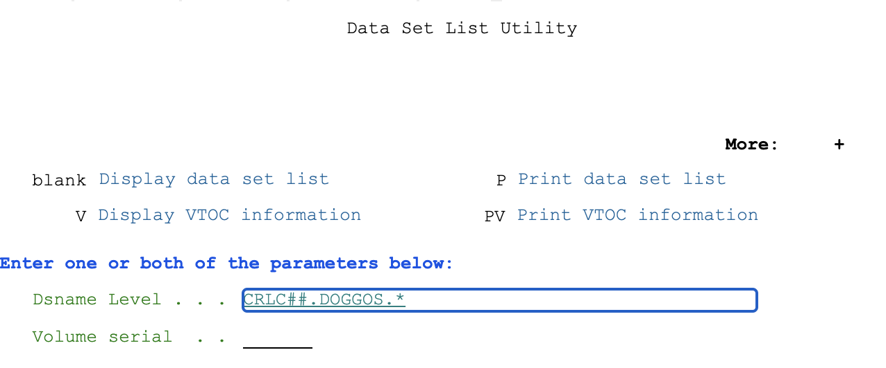

**Note: the `*` symbols means - find anything**

4. Open the `JCL` dataset to submit a new job.

5. Submit the `RUNTEST` member to run the program.

   - Wait for the message about the job return code.

6. Check the `OUTPUT` dataset details.

   - Press `Enter`, in case you will see some popups or forms coming to continue.

**Note: if you want to run the updated source code, please, rebuild the program and submit the JCL again.**

7. If you want to run the program with the updated input, please edit the INPUT dataset and submit the job (again)

   - Press `Enter`, in case you will see some popups or forms coming to continue.

