# BridgeForGit Workshop Scenario
# Admin and Developer experience 

## Login into Workshop Environment

Login at https://login.broadcom.com with the credentials shared in the email. Sharing couple of reference screenshots for the login process: 

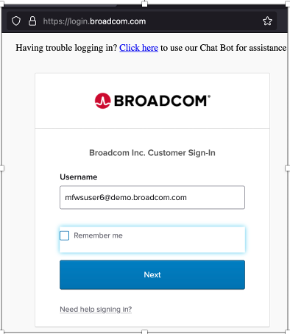

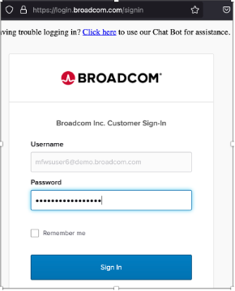

Select “Sign In”

Select the “GTO Secure Access Cloud” Application. 

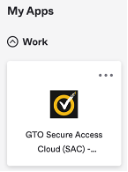

## BRIDGEFORGIT 

Section 1: 

1. Select the “BridgeForGit” tile. 

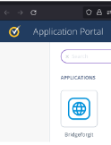

2. Authenticate via Github. Please enter the credentials shared by the instructor. 

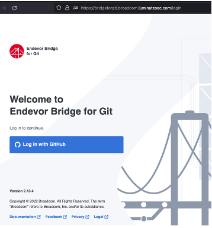

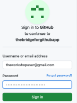

3. BridgeForGit UI gets launched. Select "Create new mapping" on the top right. 

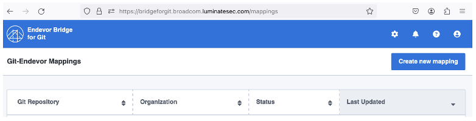

4. Select Template for "Simple Mapping Definition"

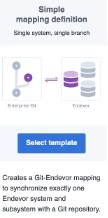

Enter the Github url. The Url will be of the format https://github.com/theworkshopuser/doggos-custxx. Replace xx with your user id number. 

Select Next. 

Endevor Connection page will appear. Keep the defaults. 

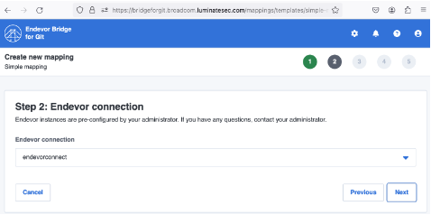

Select Next. 

Enter the Branch name as “main”. Keep the other fields as defaults. 

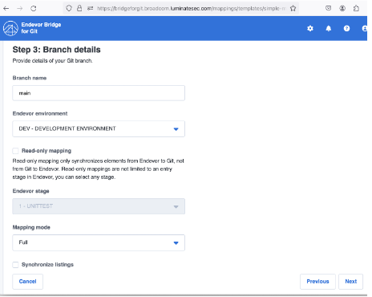

For Map Inventory details.
- For Endevor System, Select “DOGGOS-DOGGOS”. 
- For Endevor Sub System, Select “Cust00x-Cust00x”. Replace x with your User ID.
- For Element Types, Select

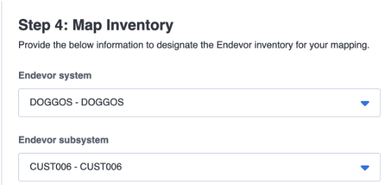

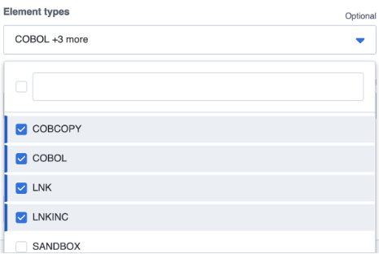

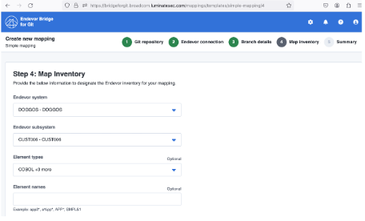

Select Next. 

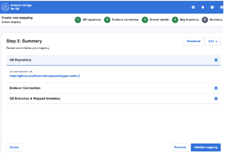

Select “Initialize Mapping”

The Mapping initialization Begins.

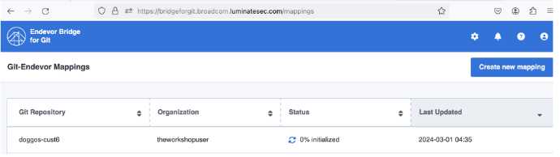

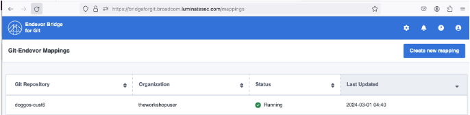

Section 2: 

Access the workspace.  

From the Application Portal Page. The page where you selected “BridgeForGit” before, now select “MSD-Workshop”. Sharing a reference screenshot: 

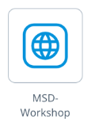

This will launch the Workshop environment: 

Select “Workspaces” Tab. 

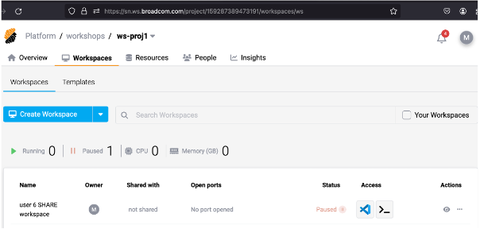

Hover over the paused status, it will list the option to Run. Select Run

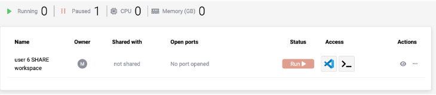

This will launch the workspace. 

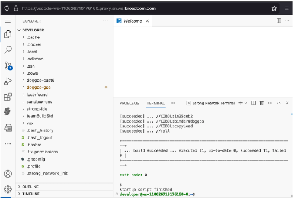

Please wait for the startup script to be finished. 

Section 3: 

From the Workspace, Clone the newly mapped github repo. 
Command: git clone git@github.com:theworkshopuser/doggos-cust6.git

Replace the doggos-cust6.git with user id number. For instance if you are user 16, then it will be doggos-cust16.git

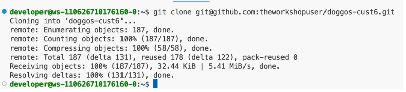

Cd into the cloned repo directory and switch to main branch. 

Commands: 
cd doggos-cust6/
git checkout main

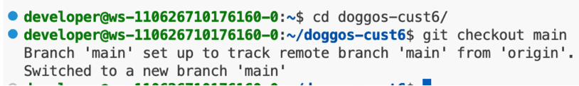

Open the doggos-cust6 folder in the VSCode Explorer and select the file that corresponds to your User Id. 

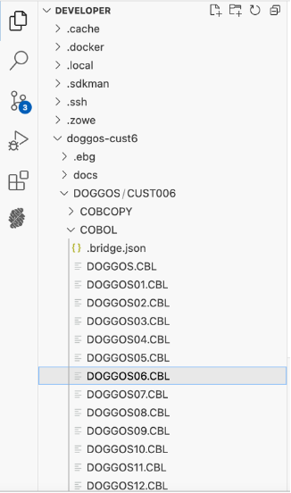

Make a Quick change. Update one of the existing comments. 
Change line 20 from 

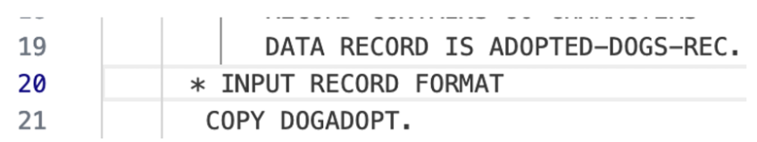

To

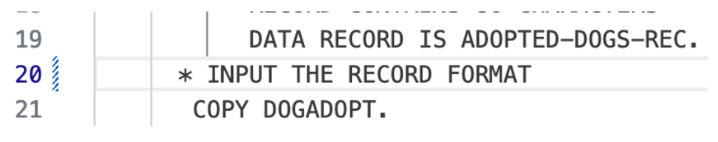

Save the file. 

Track, commit and push the changes into the github repo. 

git add . 
git commit -m "updated a comment"
git push

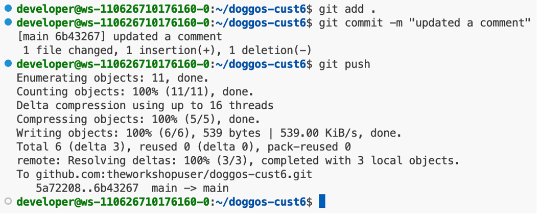

At this point, User edited a cobol file, pushed the changes to Github. With BridgeForGit Mapping that is already performed between this Github repo to the Endevor, the changes are synched with the Endevor.
To validate that the changes got synced to Endevor, Perform the below steps. 

Firstly switch to the DOGGOS_GSE folder in the Explorer tab. 

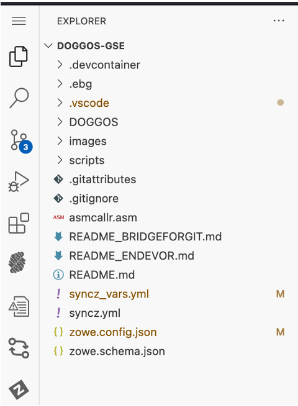

Launch the "Explorer for Endevor" extension, This extension is already configured to Endevor instance and Inventory location. Select the configurations that get listed. Sharing reference screenshots:

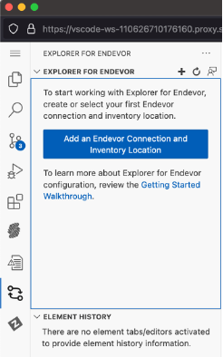

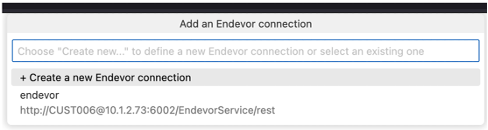

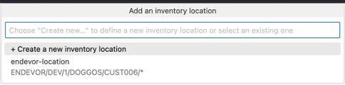

Expand the folder structure in Explorer tab and select "show history"

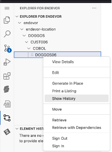

This will list the file changes and Element history. 

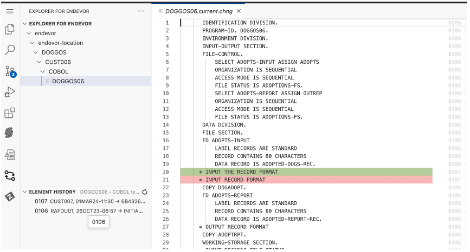

