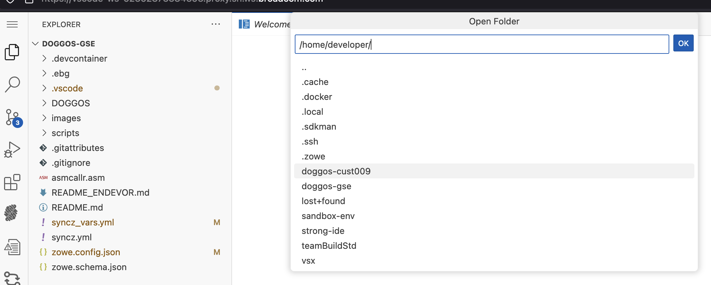
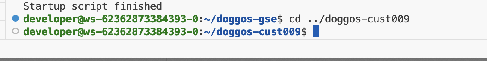
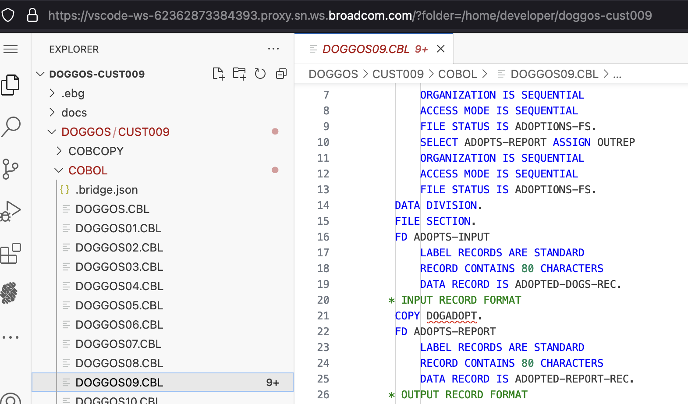
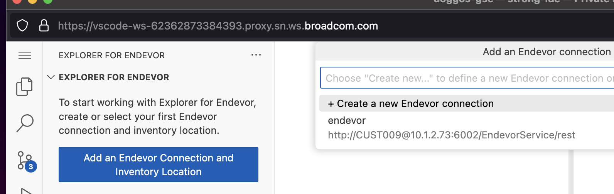
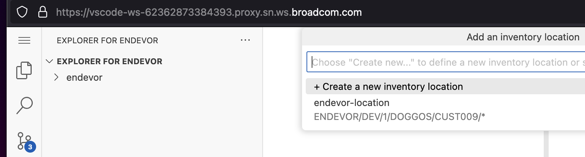

# BridgeForGit Workshop Scenario 

## Getting Started

1. Login the workshop system using the given URL, username and password
2. You are in the secure cloud environment which runs VS Code and is connected to the Mainframe
3. Make sure the initial build process has successfully completed. (**exit code: 0** message in the active terminal)
4. Close the terminal from it's right top corner

## BRIDGEFORGIT 

In the Strong Network workspace, select the Burger icon on the top left, File -> Open Folder -> under /home/developer, select the doggos-cust0## repo where ## replaced by 09 or 10 etc. and Select Ok. Sharing a reference screenshot: 

This will load the "doggos-cust0##" github repository contents in the Explorer. From command line, switch to the corresponding git repository folder contents. Sharing a reference screenshot: 

Edit a file under the below structure:
DOGGOS-CUST0## -> DOGGOS -> CUST0## -> COBOL -> DOGGOS##.CBL
Edit an existing comment by adding something like THE in front of it. 

Then run the Git commands:  
git add .  
git commit -a "Addming a comment to the line ##"  
git push  

Sharing a reference screenshot: 

At this point, User edited a cobol file, pushed the changes to Github. With BridgeForGit Mapping that is already performed between this Github repo to the Endevor, the changes are synched with the Endevor. 

To validate that the changes got synced to Endevor, Launch the "Explorer for Endevor" extension, This extension is already configured to Endevor instance and Inventory location. Select the configurations that get listed. Sharing reference screenshots: 

Open the Explorer For Endevor tree in the Explorer tab to the element that got updated via the git push. Open the element and the user can see the update made and pushed to the Git. The changes can also be observed via the Element History. 

This exercise shows that a push into github repo is sycnhed with Endevor on the Mainframe (zD&T in this workshop scenario) and the user validates the changes with "Endevor For Explorer" extension. 