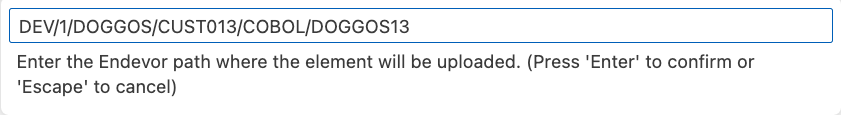
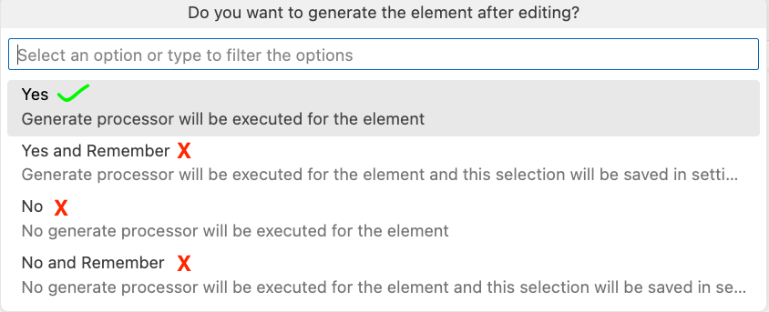

# Code/Build/Debug Challenge
# Main Scenario
## Getting Started

1. Login to the workshop system using the given URL, username, and password, and follow the steps your instructor provides

 →  → 

2. You are in the secure cloud environment which runs VSCode and is connected to the Mainframe
3. Make sure the initial build process has been completed successfully (**exit code: 0** message in the active terminal)
4. Close the terminal from it's right top corner

## Get familiar with the VSCode Activity Bar

## Run the DOGGOS application
1. Go to Zowe Explorer (Z icon in the VSCode Activity Bar)
1. Hover the “zosmf” item in the DATA SET section in the sidebar and click on the magnifier icon
1. Fill in the data set: CUST0xy.PUBLIC to add all data sets with this prefix to Zowe Explorer (Use your userID number instead of CUST0xy) 
1. Expand the CUST0xy.PUBLIC.JCL data set and right-click on the RUNDOG
1. Select “Submit Job” menu item, then click "Submit" from the pop-up window 
1. Click on the JOB number in the pop-up message in the right bottom corner to see the JOB output (if the notification disappears, you can hit the bell icon from the bottom-right corner to see)
1. Expand the “RUNDOG(JOBxxxxx)” and click on the RUN:OUTREP item to browse the program output (Repeat the 6th step if you cannot expand the job output)
1. Breeds not specified in the COBOL code, fall into the OTHER section in the execution report. Now, your task is to add one more breed to the program to result in printing it in this report

## Get DOGGOS application from the PROD environment

1. Go to Explorer for Endevor extension from the Activity Bar
2. Wait for the initializing process to be completed
3. Expand **endevor** and **endevor-location** wait for fetching the elements (connection and location settings have already been pre-configured prior the workshop)
4. Fetching the elements will result in a warning due to your empty dev sandbox
5. Map the changes from the prod environment using the up-arrow

6. Now you have all of the DOGGOS applications in your cloud VSCode IDE.
7. Find the COBOL code associated with your user under the [MAP] folder by expanding as shown below
8. Right-click, select edit, and start coding to add a new dog breed.

## Edit&Build the DOGGOS application

1. Copy block of code (lines 59-61)
2. Paste it after line 61 (You can use CTRL+G to jump into the given line number)
3. Change JINGO to another dog breed name (e. g. **HUSKY**) in the whole pasted block of code
4. For HUSKY-INDEX-VALUE change VALUE to 9  (line 63)
5. For OTHER-INDEX-VALUE change VALUE to 10 (line 66)
6. Change PIC 9(1) to PIC 9(2) for OTHER-INDEX-VALUE (line 66)
7. Change OCCURS value to 10 (line 71)
8. Copy block of code (lines 208-210)
9. Paste it after line 210
10. Change JINGO to the dog breed name you picked in step 3 (**HUSKY**) within the pasted block of code
11. Copy block of code (lines 139-142)
12. Paste it after line 142
13. Change JINGO to the dog breed name you picked in step 3 (**HUSKY**) within the pasted block of code
14. Use CTRL+S (or COMMAND+S) to save the changes and bring the file to your sandbox
15. A prompt will ask for the Endevor path to upload the COBOL element. Hit enter to approve the pre-filled value

16. Add your mainframe username as CCID, and add a change comment (e.g 'new breed added').
17. Select **Yes** from the list to generate the object modules

18. Wait for upload&fetch elements

## Link the DOGGOS application

1. Expand the LNK folder, find the element associated with your user under the [MAP] folder, right click and select edit

2. Without any edit, use CTRL+S (or COMMAND+S) to bring the file to your sandbox
3. A prompt will ask for the Endevor path to upload the link element. Hit enter to approve the pre-filled value
4. Add your mainframe username as CCID, and add a comment (e.g 'bring link element').
5. Select **Yes** from the list to generate the load modules

6. Wait for upload&fetching elements
7. Collapse the [MAP] folders to see your edited LINK element
8. At this step your Explorer for Endevor tab would look like the following:

## Run the DOGGOS application AFTER the change is made

1. Go to Zowe Explorer (Z icon in the VSCode Activity Bar)
2. Hover the “zosmf” item in the DATA SET section in the sidebar and click on the magnifier icon.
3. Click on the CUST0xy.PUBLIC.INPUT data set  to edit it
4. Add the following line with the name of the dog breed you chose in the code change (**HUSKY**)

5. Use CTRL+S (or COMMAND+S) to save the change
6. Expand the CUST0xy.PUBLIC.JCL data set and right click on the **NDRUNDOG**
7. Select “Submit Job” menu item, then click "Submit" from the pop-up window
8. Click on the JOB number in the pop up message in the right bottom corner to see the JOB output
9. Expand the “NDRUNDOG(JOBxxxxx)” and click on the RUN:OUTREP item to browse the program output (Repeat 8th step if you cannot expand the job output)

The new dog breed “HUSKY” is listed and the counter reports 11 adopted HUSKY dogs. 🎉

## Debug

1. Let’s introduce a bug in the program data 🙂 Go to the input file again and change the breed from “JINGO” to “JINGA”.
2. Use CTRL+S (or COMMAND+S) to save the change
3. Rerun the application repeating the steps in the previous section (from 6th step) 
4. Open the output file and see that report is wrong, it now contains 0 for JINGO and 6 for the OTHER
5. Let’s debug the program
6. Go to debugger extension by clicking the play icon with a bug  shortcut: CTRL+SHIFT+D (or COMMAND+SHIFT+D)
7. We already have the debugging session preconfigured for DOGGOS application, make sure you choose the one for Endevor from the dropdown

8. Click the play button to start the debugging

9. You will be asked for your Mainframe password. It is the same as your  mainframe userID. Now the debugger will fetch the extended source and start the session.
10. Now where to put a breakpoint?
11. The report for JINGO breed was wrong, so let’s put a breakpoint where the value is updated. Let’s find the first place in the code by searching for JINGO with Ctrl+F (CMD+F on Mac).
12. We can see that processing for JINGO breed is handled by these variables.
13. Let’s find all instances where JINGO-BREED-NAME by right-clicking on it, and selecting Peek → Peek references. Go through the references to find where the amount is updated. It will be here around line 238 in extended source:

14. Double-click on the 238 line in the editor window to move there.
15. Now let’s add a breakpoint after this condition to see if we get there.
Click on the left area on line 239. The red dot will appear

16. The value for OTHER breeds was wrong in the repo. Let’s put there a breakpoint as well
That would be on line 245

17. We now have 2 breakpoints (you can see them in breakpoints section in the bottom left corner):

18. Now let’s continue the execution by clicking the play button on the left of the debug toolbar (or F5):

19. We can see that while looping through the breeds the debugger skipped the breakpoint on line 239 and stopped at line 245

20. Let’s check the variables. Click on the INP-ADOPTED-AMOUNT variable, right-click, and “Add to watch”
21. Do the same for the INP-DOG-BREED variable on line 216 to understand which breed we are analyzing
22. You can see in your watch section the value of the variables (BTW, a quick way is just to hover over a variable name in your extended source and the value will pop up)

23. As you can see we have encountered a wrong breed name “JINGA”, which means that our input file is corrupted! We also never entered a section for the JINGO breed, which means we never actually encountered this breed while parsing.
24. Now we found our problem - wrong breed in the input file :)
25. Stop the debug session by clicking the stop icon from the debugging toolbar.

