# Test Challenge

## Getting Started

1. Login to the workshop system using the given URL, username, and password, and follow the steps your instructor provides

 →  → 

2. You are in the secure cloud environment which runs VS Code and is connected to the Mainframe
3. Make sure the initial build process has been completed successfully (**exit code: 0** message in the active terminal)
4. Close the terminal from it's right top corner

## Test the DOGGOS application
 
From the VS Code Explorer, Open the TestDrive Folder. Reference screenshots: 
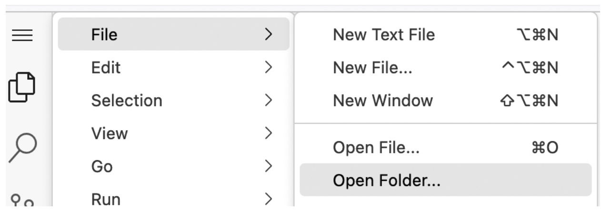        

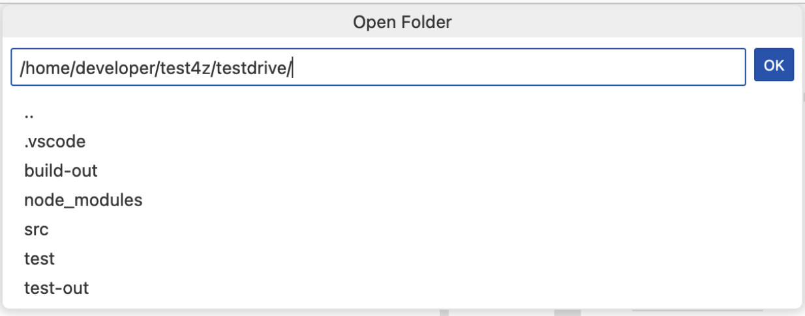

## Generate Test coverage report 

Right click on the Test Folder and select “Test4z Run All Tests with Coverage”. Reference screenshot: 

This will generate the report.

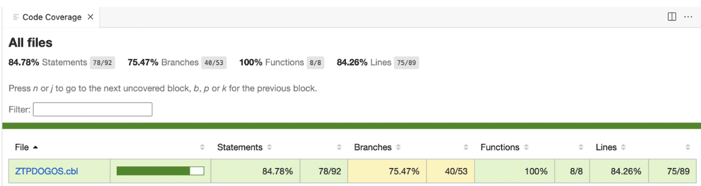

Under the src → cpy folder.       
Open the source code file "ZTPDOGOS.cbl".            
VSCode Coverage Gutters in the source code file are observed. 

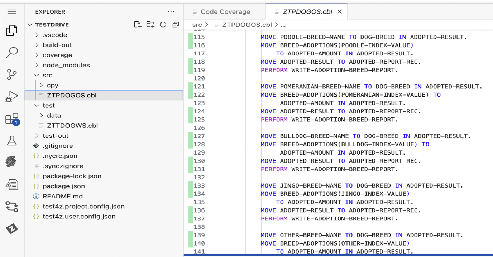

## Edit a Test case 

Open the ZTTDOGWS.cbl file under test → data folder

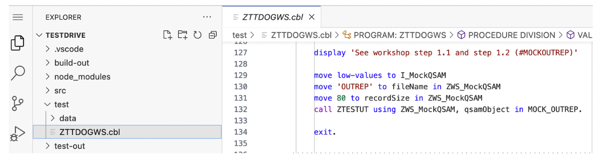

Go to line number 196.      
Change the value from 9 to 900.      
Reference screenshot: 

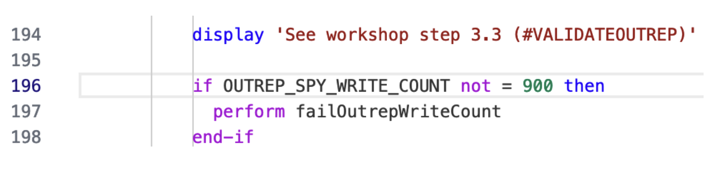

From the command line, run the “t4z” command.     
Reference screenshot: 

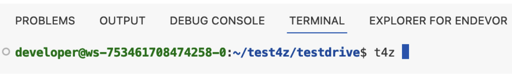

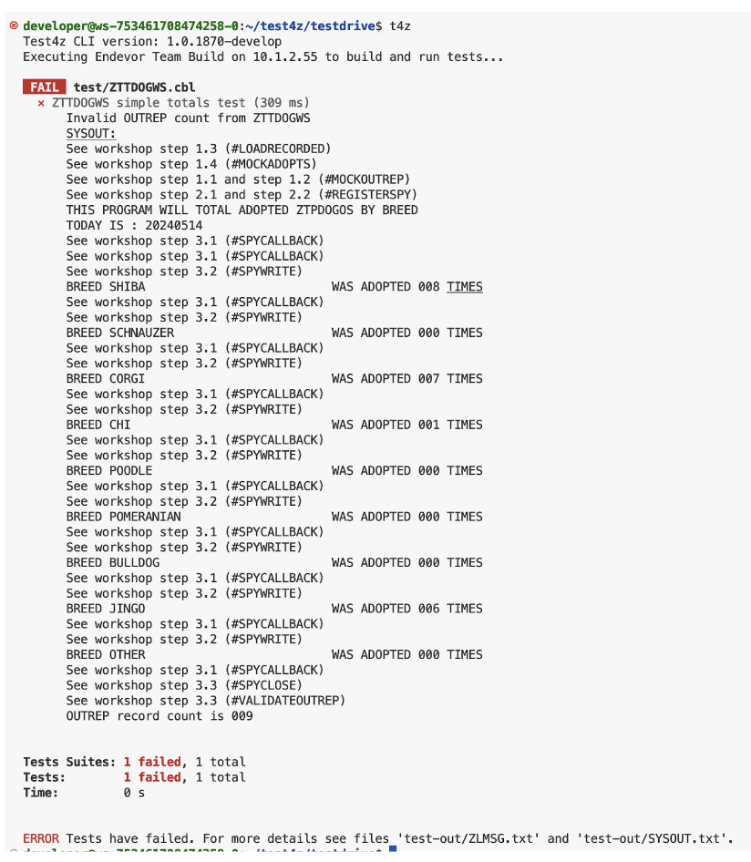

You will observe that the test run is a failure. Expected Record count is 9 whereas we edited the value to be 900.

## Add statements to Test File

Open the ZTTDOGWS.cbl file under test → data folder

Go to line 51 (Be under the PROCEDURE DIVISION section). Reference Screenshot: 

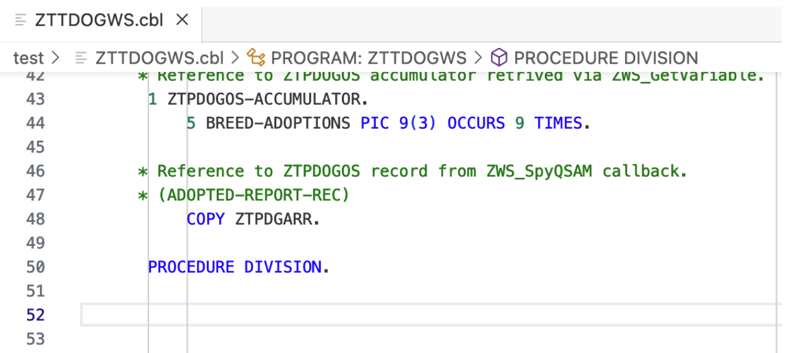

Move the cursor to column 12.       
Type "t4z me".      
Note: It will start filling out the intellisense.      
Select “t4z Message write”.     

Reference Screenshots: 

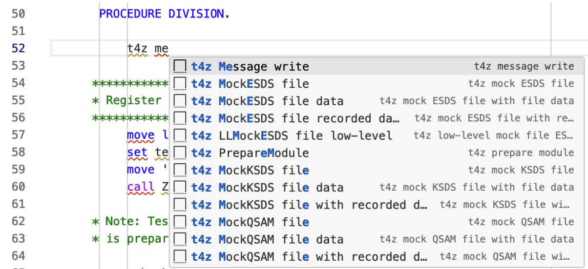

This will fill in the code for the user. 

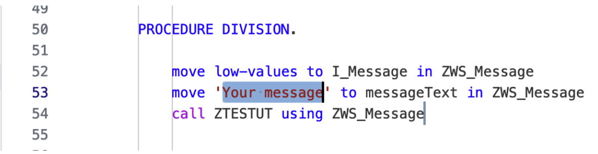

Replace “Your Message” with “Hello Test4z” and save the file. 

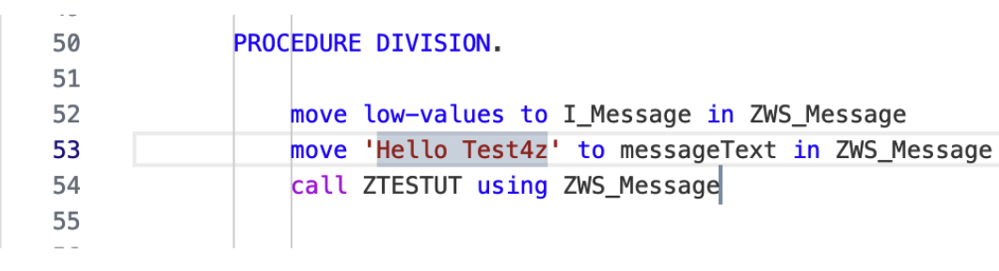

Go to line number 196.      
Change the value from 900 to 9.     
Reference screenshot: 

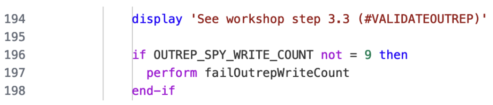

From the command line, Run “t4z”. Reference screenshot of command line output.

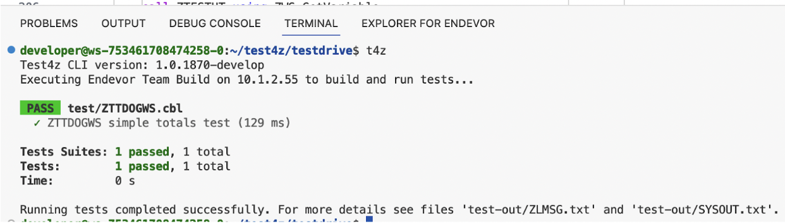

Select “ZLMSG.txt” file from the “test-out” folder. This file contains the statements that are added to the test files. You will see the “Hello Test4z” statement that was added.

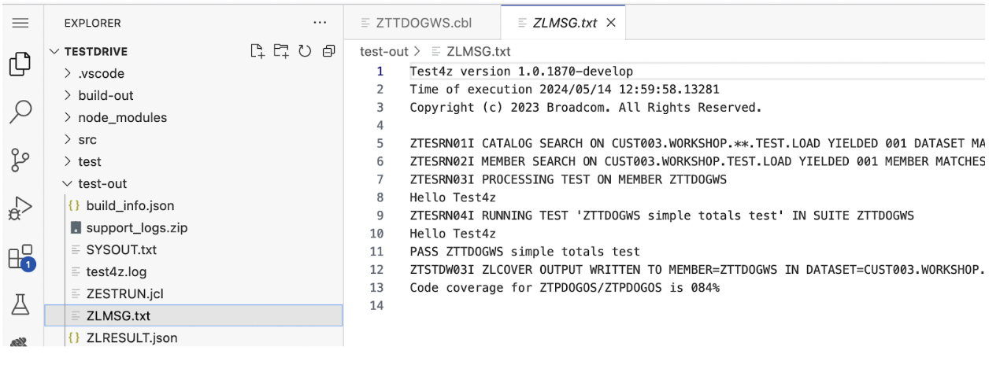         

#### Conclusion

This demo scenario shows how to generate a test coverate report, edit a test case and add statements to a test file. 

